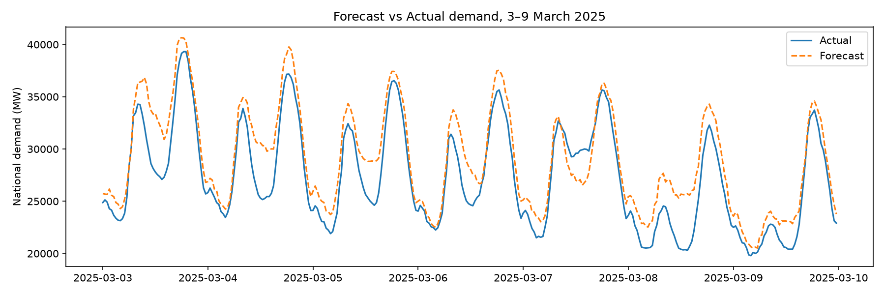
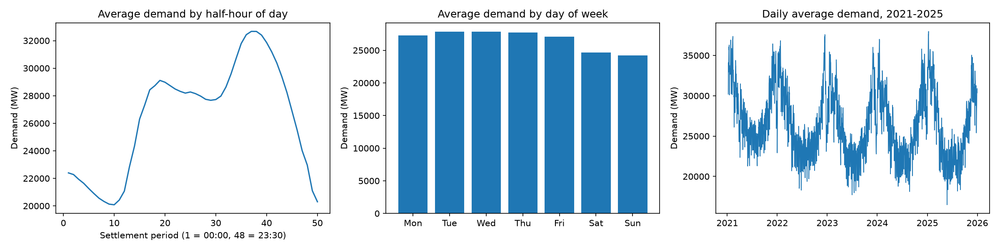
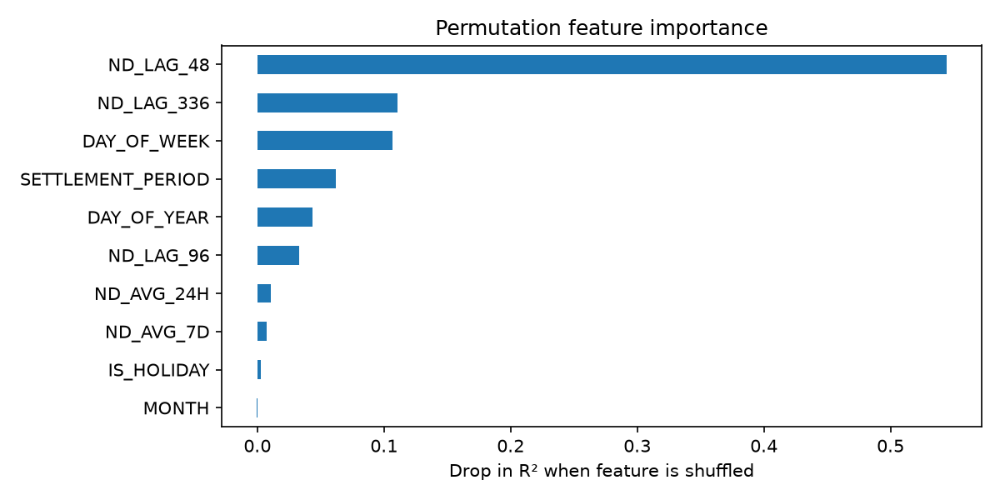

# Day-Ahead Electricity Demand Forecasting for Great Britain
 
Forecasting national electricity demand for each half-hour of the next day, using five years of public data from the National Energy System Operator (NESO).
 
**Result:** the model forecasts 2025 demand with a **5.35% mean absolute percentage error (MAPE)**, a **27% reduction in error** compared with the best simple baseline.
 

 
---
 
## Why this matters
 
Grid operators, energy suppliers and traders need to know how much electricity will be used tomorrow, half-hour by half-hour. Over-forecasting means paying for power that isn't needed. Under-forecasting means buying at short notice, often at higher prices. Even small improvements in accuracy have real financial and operational value.
 
## Data
 
- **Source:** NESO Data Portal, *Historic Demand Data*
- **Period:** January 2021 to December 2025
- **Size:** 87,648 half-hourly records (48 settlement periods per day)
- **Target:** National Demand (`ND`), in megawatts
## Approach
 
### 1. Exploring the patterns
 
Before modelling, I checked the main patterns in demand. Demand peaks in the early evening, drops at weekends, and is higher in winter than in summer. These patterns are why calendar features are included in the model.
 

 
### 2. Features
 
For each half-hour, the model uses only information that would be available the day before:
 
| Feature | Description |
|---|---|
| `ND_LAG_48` | Demand at the same half-hour yesterday |
| `ND_LAG_96` | Demand at the same half-hour two days ago |
| `ND_LAG_336` | Demand at the same half-hour last week |
| `ND_AVG_24H` | Average demand over the previous 24 hours |
| `ND_AVG_7D` | Average demand over the previous 7 days |
| `SETTLEMENT_PERIOD` | Half-hour of the day (1 to 48) |
| `DAY_OF_WEEK` | Day of the week |
| `DAY_OF_YEAR` | Day of the year, capturing seasonality |
| `IS_HOLIDAY` | UK bank holiday flag |
 
### 3. Feature selection
 
The first version also included `MONTH`. Permutation importance showed it contributed nothing (its importance was slightly negative), because `DAY_OF_YEAR` already captures the same seasonal pattern in more detail. Removing it made the model simpler without any loss of accuracy (MAPE 5.37% before, 5.35% after).
 
### 4. Train and test split
 
The data is split **by time, not randomly**: the model is trained on 2021 to 2024 and tested on the whole of 2025. A random split would let the model see future data during training and make the results look better than they would be in practice.
 
### 5. Model
 
A `HistGradientBoostingRegressor` from scikit-learn, with early stopping to prevent overfitting.
 
## Results
 
Tested on all of 2025, against two common benchmarks used in energy forecasting:
 
| Method | MAPE | MAE (MW) |
|---|---|---|
| **Gradient boosting model** | **5.35%** | **1,328** |
| Same time yesterday | 7.36% | 1,846 |
| Same time last week | 8.47% | 2,186 |
 
The model also achieves an R² of 0.916 on the test year.
 
### What drives the forecast
 
Permutation importance shows how much accuracy drops when each feature is shuffled. Yesterday's demand is by far the most useful signal, followed by the day of the week and last week's demand.
 

 
## Where the model goes wrong
 
The largest errors occur **around midday on sunny days**, where the forecast sits above actual demand. National Demand is measured after rooftop and other embedded solar generation, so on sunny days the grid sees a midday dip. The model has no weather information, so it cannot anticipate this.
 
## Data quality issues found along the way
 
- **Inconsistent date formats.** The yearly files use three different formats (`01-JAN-2021`, `01-Jan-23` and `2025-01-01`). Forcing day-first parsing silently swapped the day and month for 2025, scrambling the test year. The dates are now parsed with mixed-format handling and checked against the expected number of days per year.
- **Partly empty columns.** One unused column is blank for 2021 and 2022. Dropping every row with any missing value removed those two years entirely, so rows are now only dropped when a model feature is missing.
## Next steps
 
1. **Add weather data** (temperature, cloud cover, solar irradiance and wind speed), for example from the Open-Meteo API. This targets the midday solar errors directly.
2. **Handle clock-change days** properly. Days when the clocks change have 46 or 50 half-hours instead of 48, which slightly misaligns the lag features around those dates.
3. **Tune and compare models**, including time-series cross-validation across several years.
## Project structure
 
```
neso-demand-forecasting/
├── data/
│   ├── raw/                  # NESO yearly CSV files (2021-2025)
│   └── processed/            # Combined dataset
├── notebooks/
│   └── demand_forecasting.ipynb
├── src/
│   └── data_processing.py    # Combines and cleans the raw files
├── demand_patterns.png
├── forecast_vs_actual.png
├── feature_importance.png
└── requirements.txt
```
 
## How to run
 
```bash
git clone https://github.com/roodruh/neso-demand-forecasting.git
cd neso-demand-forecasting
pip install -r requirements.txt
jupyter notebook notebooks/demand_forecasting.ipynb
```
 
## Tools
 
Python, pandas, NumPy, scikit-learn, Matplotlib, holidays, Jupyter